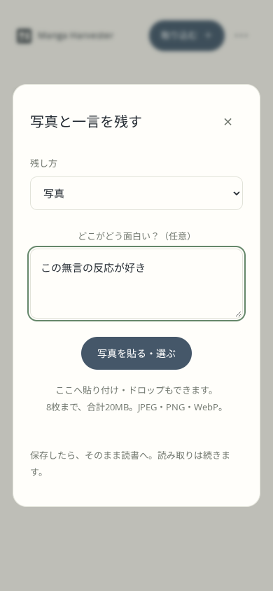
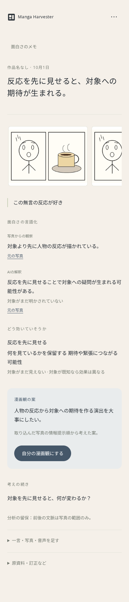
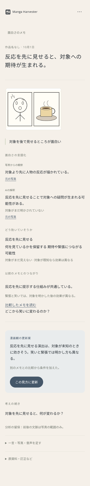
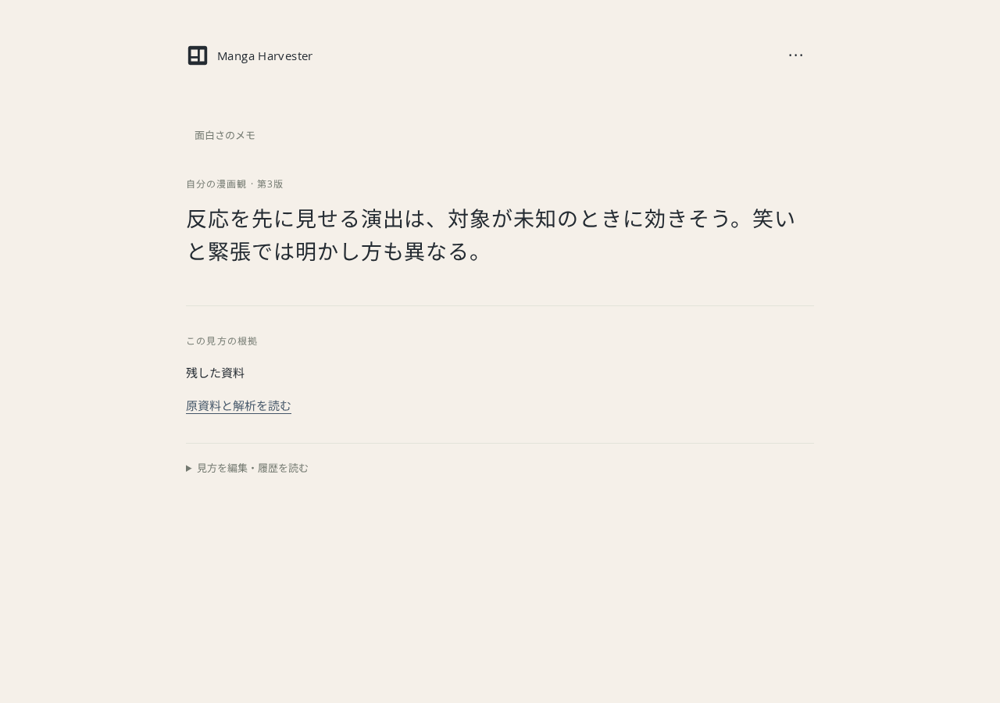
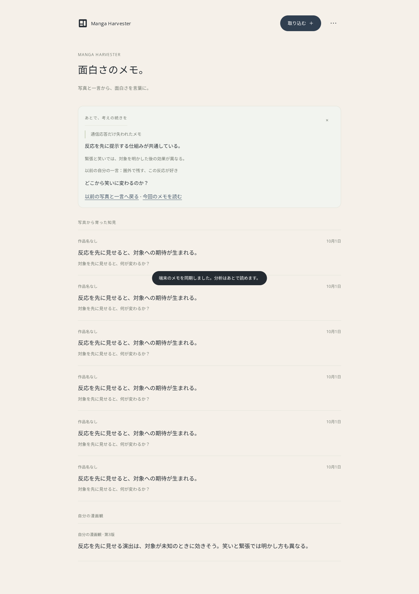

# 実装の検証

## 実施済み

- TypeScript型検査、Workerのdry-runビルド、SQLマイグレーション。
- 保存から解析・グラフ・比較・漫画観採用までの統合テスト17件。AIプロバイダーの返答だけを注入。
- 実workerd／D1／R2／Queueの経路で、ログイン、複数写真＋一言、永続ジョブ登録、再送、画像取得、日本語検索、原ファイル付き書き出し、外部資料レコードの版付き訂正・調査ジョブ登録・キャンセル、削除後の古い再送拒否、ログアウト。
- Chromiumで390pxと1280px。写真選択後の自動保存、画像貼り付け、再読込、両側の比較、漫画観採用／編集／履歴、マイク拒否時のファイル入力への復帰。
- ブラウザ内のPDF変換、CBZの非選択画像を送らない保存、同一ファイルからの続きと取り込み元の対応表示。
- ブラウザを圏外にして写真を保存し、再読込後に同じ元ファイルが残ること、復帰時に同期すること、サーバー応答だけが失われても記録・AIジョブが一つであること。
- 局所グラフ・概念詳細、意味検索の理由と実際の記述、外部調査案の明示採用から第4版への更新。
- 再訪候補の見送り／再提示抑制、更新された比較先の無効化、仮想比較の根拠必須。
- 概念の統合／別名／メモごとの意味分割／取り消しで、元の分析ノード・原資料・採用履歴が変わらないこと。
- 検索へ写真・非公開メモを送らないこと、取得していないURL・抜き書き・Claim参照の拒否、検索取得後の再開、キャンセル、応答不明時に検索予算を再使用しないこと。
- ホーム・入力・記録詳細で、表示される強調主操作は一つ。横方向の画面はみ出しなし。写真のまとまりは横にスクロールして開ける。
- ページ・巻話・コマ・読順の型やSQL列を持たないことを確認。原写真／本人の言葉／AIの解釈を分離。

## 操作の再現

1. `npm run test:browser` で検証用サーバーとブラウザを起動。
2. ホームで「取り込む」を開き、任意の一言を添え、複数写真を選ぶ。保存後にダイアログが閉じる。
3. 再読込してメモを開く。元写真、本人コメント、観察、解釈、仕組み、漫画観案を読む。
4. 「自分の漫画観にする」で採用し、本文と理由を編集。第2版の履歴を確認。
5. 別の写真をクリップボードから貼り付け、以前のメモとの共通点／違いと比較先を確認。
6. スマホ／PC幅で主操作数、画像、文字、横はみ出しを確認。
7. マイクが使えない状態でも音声ファイル入力が使えることを確認。

以下の画像は自作の図と注入した分析を用いたUI検証の証跡です。実モデルによる画像理解の品質証明ではありません。

### 入力

### 記録を読む

### 過去との比較

### PCのホーム

### 振り返り・再訪

## 未実施

OpenAI APIキー、本番Cloudflareリソース／secretが未設定です。実APIの画像理解・文字起こし・比較・意味検索・外部調査の出典内容と適用範囲・漫画観案の品質、実スマホのPWA／録音／容量不足／ストレージ消去は未検証です。暗号化・壊れたPDF、巨大な実アーカイブ、端末ごとのPDF描画の差も追加確認が必要です。実機での操作数比較は未実施です。Issues #1〜#8は開いたままにし、実装済み項目と残る検証を各Issueへ記録しています。

## マージ範囲

Webアプリ・PWAの実装（#1〜#7）を対象とします。iOSアプリと共有拡張（#8）は含めず、[別ブランチ](https://github.com/kdob1042/manga-harvester/tree/codex/manga-native-ios/ios)に保持しています。
